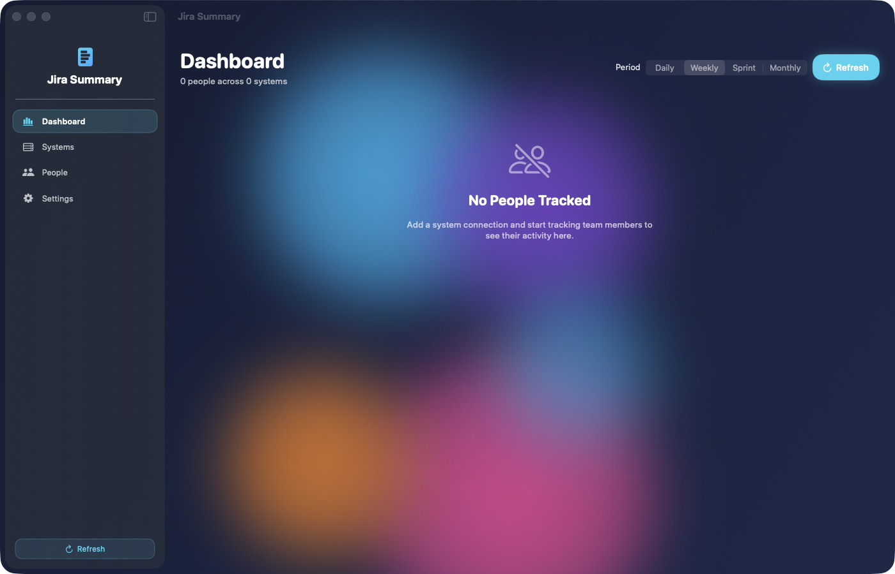

# JiraSummary


A native macOS application for tracking team activity across Jira Cloud, Jira Server/Data Center, and Azure DevOps -- all from a single dashboard. Built for engineering managers and tech leads who need weekly summaries, sprint velocity charts, and AI-generated insights without switching between three different browser tabs.

**Version:** 1.1.0 | **Bundle ID:** com.jordankoch.JiraSummary

---



---

## Table of Contents

- [Architecture](#architecture)
- [Features](#features)
- [Requirements](#requirements)
- [Installation](#installation)
- [Usage](#usage)
- [AI Configuration](#ai-configuration)
- [API Integration](#api-integration)
- [Widget Extension](#widget-extension)
- [Local HTTP API](#local-http-api)
- [Project Structure](#project-structure)
- [Security](#security)
- [Troubleshooting](#troubleshooting)
- [Building from Source](#building-from-source)
- [License](#license)

---

## Architecture

```
+-------------------------------------------------------------------------+
|                          macOS Application                               |
|                                                                         |
|  +-----------------------------+   +--------------------------------+   |
|  |        SwiftUI Views        |   |       Menu Bar Item            |   |
|  |  Dashboard  | Systems       |   |  Completed / In Progress /     |   |
|  |  People     | Activity      |   |  Blocked counts + Refresh      |   |
|  |  Settings   | Detail Tabs   |   +--------------------------------+   |
|  +-----------------------------+                                        |
|         |            |                                                  |
|         v            v                                                  |
|  +-----------------------------+   +--------------------------------+   |
|  |      Service Layer          |   |    AI Backend Manager          |   |
|  |  (Swift Actors + async)     |   |  10 backends, auto-fallback   |   |
|  |                             |   |                                |   |
|  |  DataFetchCoordinator       |   |  Local:                       |   |
|  |    +-- JiraCloudService     |   |    Ollama | MLX | TinyLLM     |   |
|  |    +-- JiraServerService    |   |    TinyChat | OpenWebUI       |   |
|  |    +-- AzureDevOpsService   |   |                                |   |
|  |  SummaryEngine              |   |  Cloud:                       |   |
|  |  SSOAuthService (WKWebView) |   |    OpenAI | Google | Azure    |   |
|  |  MenuBarManager             |   |    AWS | IBM Watson            |   |
|  +-----------------------------+   +--------------------------------+   |
|         |            |                        |                         |
|         v            v                        v                         |
|  +-----------------------------+   +--------------------------------+   |
|  |       Data Layer            |   |    AISummaryService            |   |
|  |  DataStore (JSON files)     |   |  Prompt construction +         |   |
|  |  KeychainService (macOS     |   |  natural language summaries    |   |
|  |    Keychain credentials)    |   +--------------------------------+   |
|  +-----------------------------+                                        |
|         |                                                               |
|         v                                                               |
|  +-----------------------------+   +--------------------------------+   |
|  |   Widget Data Sync          |   |   Nova API Server              |   |
|  |   Shared JSON for widget    |   |   HTTP on 127.0.0.1:37433     |   |
|  |   WidgetKit integration     |   |   /api/status  /api/ping      |   |
|  +-----------------------------+   +--------------------------------+   |
|                                                                         |
+-------------------------------------------------------------------------+
         |                    |                       |
         v                    v                       v
  +-----------+     +----------------+      +------------------+
  | Jira Cloud|     | Jira Server /  |      | Azure DevOps     |
  | REST v3   |     | Data Center    |      | REST 7.1         |
  | (Atlassian|     | REST v2        |      | (WIQL queries,   |
  |  Cloud)   |     | (On-premise)   |      |  work items,     |
  |           |     |                |      |  iterations)     |
  +-----------+     +----------------+      +------------------+
```

**Key architectural decisions:**

- **Zero external dependencies.** Every component uses native Apple frameworks: SwiftUI, WebKit, Network, Security, WidgetKit, Swift Charts.
- **Swift Structured Concurrency.** All network fetching uses async/await with `withTaskGroup` for parallel system queries. Service classes are `@MainActor` actors for thread safety.
- **Observation framework.** State management uses `@Observable` (not Combine), keeping the reactive layer modern and lightweight.
- **Keychain-first credential storage.** All authentication tokens, session cookies, and API keys are stored in macOS Keychain with `WhenUnlockedThisDeviceOnly` access control. API keys are migrated from UserDefaults to Keychain on first launch.

---

## Features

### Multi-System Dashboard

Connect to any combination of Jira Cloud, Jira Server/Data Center, and Azure DevOps instances simultaneously. Each system gets its own authentication session and fetch pipeline. Data from all systems is aggregated into a single unified dashboard.

### SSO Authentication

An embedded WKWebView handles single sign-on flows for Okta, Azure AD, and SAML providers. After login completes, JiraSummary captures the session cookie (cloud.session.token for Jira Cloud, JSESSIONID for Jira Server, FedAuth/AadAuth for Azure DevOps) and stores it in macOS Keychain. No passwords are ever stored -- only session tokens with natural expiry.

### Activity Tracking and Summaries

- **Period-based views:** daily, weekly, sprint, or monthly time ranges
- **Per-person summary cards** with ticket counts, velocity gauges, and AI-generated insights
- **Aggregate statistics:** total tickets, completed, in progress, blocked, average velocity
- **Sortable ticket tables** with search and filter
- **Status transition timeline** grouped by day
- **Sprint velocity bar charts** showing committed vs. completed points across the last 8 sprints (Swift Charts)

### AI-Powered Summaries (10 Backends)

JiraSummary supports 10 AI backends with automatic fallback. If the active backend is unavailable, the next one in priority order is tried automatically.

| Type | Backend | Default URL / Detection |
|------|---------|------------------------|
| Local | Ollama | http://localhost:11434 |
| Local | MLX | Auto-detected at /opt/homebrew/bin/mlx_lm or /usr/local/bin/mlx_lm |
| Local | TinyLLM | http://localhost:8000 |
| Local | TinyChat | http://localhost:8000 |
| Local | OpenWebUI | http://localhost:8080 |
| Cloud | OpenAI | API key required (Keychain) |
| Cloud | Google Cloud | API key required (Keychain) |
| Cloud | Azure | API key + endpoint (Keychain) |
| Cloud | AWS | Access key + secret + region (Keychain) |
| Cloud | IBM Watson | API key + URL (Keychain) |

Features include configurable generation parameters (temperature 0.0--1.0, max tokens 50--2000), per-backend usage statistics and performance metrics, cost estimation for cloud backends, background health monitoring at 60-second intervals, and one-click connection testing.

### Menu Bar Integration

A persistent menu bar item shows summary counts (completed, in progress, blocked), last refresh time, a one-click data refresh button, and a shortcut to open the main window. The app continues running when the last window is closed.

### Widget Extension

A WidgetKit extension displays ticket counts, sprint velocity, active sprint name, and top contributor on the desktop. Data syncs from the main app via a shared JSON file.

### Glassmorphic Dark Theme

The UI uses a custom design system with animated floating blobs, glass cards with blur backgrounds and gradient borders, circular progress gauges, color-coded status badges, and consistent SF Rounded typography throughout. Dark mode is enforced at the application level.

---

## Requirements

- macOS 14.0 (Sonoma) or later
- Xcode 16.0 or later (for building from source)
- XcodeGen (for project generation from source)

### Optional (for AI summaries)

Any of the supported backends listed in the AI section above. For the quickest setup:

```
brew install ollama
ollama pull llama3
ollama serve
```

---

## Installation

JiraSummary is distributed as a DMG installer. It is not available on the Mac App Store.

**Download the latest DMG from [Releases](https://github.com/kochj23/JiraSummary/releases)**, open the disk image, and drag JiraSummary to your Applications folder.

To build from source instead:

```bash
git clone git@github.com:kochj23/JiraSummary.git
cd JiraSummary
xcodegen generate
xcodebuild -project JiraSummary.xcodeproj -scheme JiraSummary -configuration Release build
```

---

## Usage

1. **Add Systems** -- Open the sidebar and click "Systems", then "Add System". Choose Jira Cloud, Jira Server, or Azure DevOps, enter the base URL, and authenticate through the embedded SSO login.

2. **Add People** -- Click "People" in the sidebar, search for team members across connected systems by name, and add them. Each person is linked to a specific system and user ID (accountId for Jira Cloud, username for Jira Server, email for Azure DevOps).

3. **View Dashboard** -- The dashboard shows a summary card for each tracked person with ticket counts, sprint velocity gauges, and AI-generated natural language insights. Use the period selector to switch between daily, weekly, sprint, and monthly time ranges.

4. **Drill Down** -- Click any person card to see full activity detail across three tabs: Tickets (sortable table), Timeline (status transitions by day), and Sprints (velocity charts for the last 8 sprints).

5. **Refresh** -- Click "Refresh" in the sidebar or configure auto-refresh in Settings. Available intervals: 15 minutes, 30 minutes, 1 hour, 2 hours, or manual only.

---

## AI Configuration

### Quick Start with Ollama

```bash
brew install ollama
ollama pull llama3
ollama serve
```

Then enable AI summaries in the app: Settings > AI Backend > Enable AI summaries. JiraSummary will auto-detect the running Ollama instance and discover available models.

### Multi-Backend Setup

In Settings, configure any combination of backends:

- **Local backends:** Set server URLs for Ollama, TinyLLM, TinyChat, and OpenWebUI. MLX is auto-detected from the filesystem.
- **Cloud backends:** Enter API keys for OpenAI, Google Cloud, Azure (key + endpoint), AWS (access key + secret + region), or IBM Watson (key + URL). All keys are stored in macOS Keychain.
- **Generation parameters:** Adjust temperature (0.0--1.0) and max tokens (50--2000) per your preference.
- **Connection testing:** Test any backend with a single click to verify connectivity and measure response time.
- **Auto-fallback:** If the active backend fails, JiraSummary tries the next available backend in priority order: Ollama, OpenAI, TinyChat, TinyLLM, OpenWebUI, MLX.

All API keys are stored in macOS Keychain and never transmitted to third parties. Local backends keep all data on your machine.

---

## API Integration

| System | API Version | Auth Method | Capabilities |
|--------|-------------|-------------|-------------|
| Jira Cloud | REST v3 | Cookie (cloud.session.token) | JQL search, changelogs, sprints, boards, user search |
| Jira Server / Data Center | REST v2 | Cookie (JSESSIONID) | JQL search, changelogs, sprints, boards, user search |
| Azure DevOps | REST 7.1 | Cookie (FedAuth / AadAuth) | WIQL queries, work item updates, iterations, team members |

All queries are parameterized. Jira JQL and Azure DevOps WIQL inputs are sanitized before inclusion in queries to prevent injection attacks.

---

## Widget Extension

The `JiraSummary Widget` target provides a WidgetKit extension that displays:

- Systems connected and total tracked people
- Ticket counts: total, completed, in progress, blocked, created
- Average velocity percentage
- Active sprint name
- Top contributor with ticket count

Data is synced from the main app to the widget via a shared JSON file in the app group container (`group.com.jordankoch.jirasummary`). The widget timeline reloads automatically after each data refresh.

---

## Local HTTP API

JiraSummary exposes a lightweight HTTP API on port **37433**, bound to 127.0.0.1 only (no external network exposure). The server starts automatically at launch.

```bash
# Health check
curl http://127.0.0.1:37433/api/ping

# App status (returns version, uptime, port)
curl http://127.0.0.1:37433/api/status
```

This API is designed for integration with local automation tools and AI assistants.

---

## Project Structure

```
JiraSummary/
|-- JiraSummary/
|   |-- Design/
|   |   +-- ModernDesign.swift              Glassmorphic design system
|   |-- Models/
|   |   |-- SystemConnection.swift          System types, auth credentials
|   |   |-- TrackedPerson.swift             Per-system user tracking
|   |   |-- TicketActivity.swift            Work items and status transitions
|   |   |-- PersonSummary.swift             Aggregated activity summaries
|   |   |-- SprintData.swift                Sprint velocity data
|   |   |-- JiraModels.swift                Jira REST API Codable types
|   |   +-- AzureDevOpsModels.swift         Azure DevOps API Codable types
|   |-- Services/
|   |   |-- DataStore.swift                 JSON persistence layer
|   |   |-- DataFetchCoordinator.swift      Parallel multi-system fetch engine
|   |   |-- SummaryEngine.swift             Data aggregation engine
|   |   |-- KeychainService.swift           macOS Keychain wrapper
|   |   |-- SSOAuthService.swift            WKWebView SSO auth flow
|   |   |-- JiraCloudService.swift          Jira Cloud REST v3 client
|   |   |-- JiraServerService.swift         Jira Server REST v2 client
|   |   |-- AzureDevOpsService.swift        Azure DevOps REST 7.1 client
|   |   |-- AIBackendManager.swift          Multi-backend AI orchestration
|   |   |-- AIBackendManager+Enhanced.swift Extended backend capabilities
|   |   |-- AIBackendManager+Generation.swift  Text generation + fallback
|   |   |-- AISummaryService.swift          AI summary prompt construction
|   |   |-- AIBackendStatusMenu.swift       Reusable backend status component
|   |   |-- MenuBarManager.swift            Menu bar status item
|   |   +-- WidgetDataSync.swift            Widget data synchronization
|   |-- Views/
|   |   |-- ContentView.swift               NavigationSplitView root
|   |   |-- Sidebar/SidebarView.swift       Navigation sidebar
|   |   |-- Dashboard/
|   |   |   |-- DashboardView.swift         Overview with aggregate stats
|   |   |   +-- SummaryCardView.swift       Per-person summary card
|   |   |-- Systems/
|   |   |   |-- SystemsListView.swift       Connection management
|   |   |   |-- AddSystemView.swift         New connection wizard
|   |   |   +-- SSOWebView.swift            SSO login WebView
|   |   |-- People/
|   |   |   |-- PeopleListView.swift        Team member inventory
|   |   |   |-- AddPersonView.swift         User search and add
|   |   |   +-- PersonDetailView.swift      Full activity detail
|   |   |-- Activity/
|   |   |   |-- TicketListView.swift        Sortable ticket table
|   |   |   |-- ActivityTimelineView.swift  Status transition timeline
|   |   |   +-- SprintVelocityView.swift    Sprint velocity charts
|   |   +-- Settings/
|   |       |-- SettingsView.swift          Full configuration UI
|   |       +-- AIBackendStatusMenu.swift   Backend status in settings
|   |-- JiraSummaryApp.swift                App entry point + AppDelegate
|   |-- NovaAPIServer.swift                 Local HTTP API server
|   |-- Info.plist                          Bundle configuration
|   +-- JiraSummary.entitlements            Sandbox disabled, network client
|-- JiraSummary Widget/
|   |-- JiraSummaryWidget.swift             WidgetKit extension views
|   |-- SharedDataManager.swift             Shared data reading
|   |-- WidgetData.swift                    Widget data model
|   +-- Info.plist                          Widget configuration
|-- project.yml                             XcodeGen project specification
|-- LICENSE                                 MIT License
|-- SECURITY.md                             Security policy
|-- CHANGELOG.md                            Version history
+-- JiraSummary.xcodeproj/                  Generated Xcode project
```

**2 targets** | **44 Swift files** | **Zero external dependencies**

---

## Security

### Credential Storage

All credentials are stored in macOS Keychain with `kSecAttrAccessibleWhenUnlockedThisDeviceOnly` access control. This includes SSO session cookies, authentication tokens, and all cloud AI API keys. A one-time migration moves any API keys previously stored in UserDefaults to Keychain automatically.

### Network

- **Outbound only.** JiraSummary makes outbound HTTPS requests to configured systems and cloud AI providers. There is no inbound server component exposed to the network.
- **App Transport Security.** NSAllowsArbitraryLoads is not set. All connections require HTTPS except for local AI backends on localhost.
- **The local HTTP API** binds exclusively to 127.0.0.1 and is not reachable from other machines.

### Input Sanitization

- **JQL injection prevention.** User input is sanitized before inclusion in Jira Query Language queries.
- **WIQL injection prevention.** Azure DevOps Work Item Query Language queries use parameterized inputs.

### Entitlements

- **No App Sandbox** -- Full file system access is enabled for system utility functionality.
- **Network Client** -- Outbound network access is enabled.
- **Hardened Runtime** -- Enabled for distribution builds.

### SSO Session Handling

No passwords are stored at any point. JiraSummary captures session cookies through the embedded WKWebView after the user completes SSO login through their identity provider. Cookies expire naturally per the provider's session policy. A non-persistent web data store is used for clean authentication sessions.

---

## Troubleshooting

### Authentication fails or SSO does not complete

- Verify the system URL includes `https://` and is correct for your instance.
- Jira Cloud: use `https://yourcompany.atlassian.net`
- Jira Server: use the full URL of your on-premise instance.
- Azure DevOps: use `https://dev.azure.com/yourorg`
- Session cookies expire naturally. Re-authenticate by clicking the system in the sidebar and logging in again.

### No data appears after refresh

- Confirm tracked people have the correct user IDs for each system type: Jira Cloud uses `accountId`, Jira Server uses `username`, Azure DevOps uses email.
- Verify your SSO session has access to the relevant projects and boards.
- Check that board IDs are configured for sprint data.

### AI summaries are not generating

- Open Settings and check the AI Backend section. Green dots indicate available backends.
- For Ollama: confirm `ollama serve` is running and at least one model is pulled (`ollama list`).
- Use the "Test Connection" button to verify backend connectivity and response time.
- Confirm AI summaries are enabled (toggle in Settings).

### Widget shows stale data

- Open the main app and trigger a manual refresh. Widget data syncs after each fetch cycle.
- Ensure the app group container (`group.com.jordankoch.jirasummary`) is properly configured if building from source.

---

## Building from Source

### Prerequisites

- Xcode 16.0 or later
- XcodeGen: `brew install xcodegen`

### Steps

```bash
git clone git@github.com:kochj23/JiraSummary.git
cd JiraSummary
xcodegen generate
open JiraSummary.xcodeproj
```

Select the **JiraSummary** scheme and build for "My Mac" (macOS 14.0+).

To regenerate the Xcode project after adding or removing source files:

```bash
xcodegen generate
```

The project uses Swift 5.9, targets macOS 14.0 (Sonoma), and has no external Swift Package Manager or CocoaPods dependencies.

---

## License

MIT License -- see [LICENSE](LICENSE) for the full text.

Copyright (c) 2026 Jordan Koch.

---

## Author

Written by Jordan Koch ([GitHub](https://github.com/kochj23)).

---

## More Apps by Jordan Koch

| App | Description |
|-----|-------------|
| [MailSummary](https://github.com/kochj23/MailSummary) | AI-powered email categorization and summarization |
| [NewsSummary](https://github.com/kochj23/NewsSummary) | AI-powered news aggregation and summarization |
| [MLXCode](https://github.com/kochj23/MLXCode) | Local AI coding assistant for Apple Silicon |
| [OneOnOne](https://github.com/kochj23/OneOnOne) | One-on-one meeting management tool |
| [ExcelExplorer](https://github.com/kochj23/ExcelExplorer) | Native macOS Excel/CSV file viewer |

[View all projects](https://github.com/kochj23?tab=repositories)

---

> **Disclaimer:** This is a personal project created on personal time. It is not affiliated with, endorsed by, or representative of any employer.
